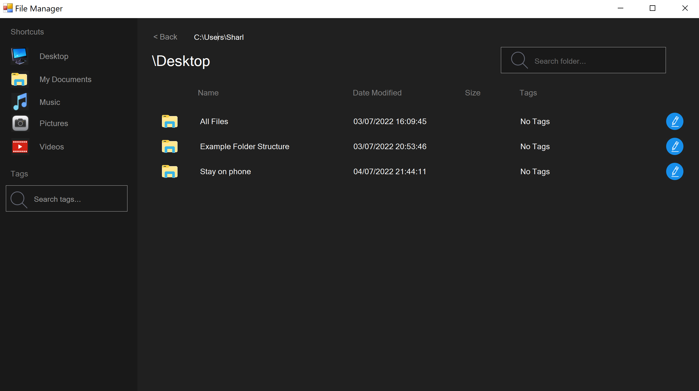

# file-manager

## About 

This is my attempt to replicate/copy the Windows File Manager app. You can view all of your files on your computer, and navigate to them, as you normally would on the original windows file explorer. 

Functionalities include:
- Viewing/opening files and directories
- Searching for files in the current folder
- Adding tags to files or directories
- Filtering files/folders by tags

Functionalities pending:
- Copying and pasting items
- Ability to work with non-windows (eg, Mac) directories

## Tech Stack 

This uses C# Windows Forms. 

## To Download 

* Click on the Code Button
	* Click on Download ZIP
	* Or clone the repository. Run the command in a command line:
		`git clone https://github.com/vondreii/file-manager.git` 
		

## To Run (Debug)

* Open `file-manager\FileManager.sln` in Visual Studio and press the green play button at the top.

## To Run (Executable)

* Run `file-manager\FileManager\bin\Debug\FileManager.exe` 

 

